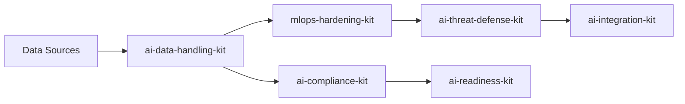

# 🗃️ AI Data Handling Kit - Phase 1

**Enterprise-grade data classification, privacy assessment, and retention management for AI systems**

> Foundation kit for GDPR, HIPAA, and CCPA compliant AI data processing. Start here for comprehensive data governance.

---

## 🎯 Quick Start

### 30-Second Deployment
```bash
# Clone the repository
git clone https://github.com/Narnaiezzsshaa/smb-ai-defense-kit.git
cd smb-ai-defense-kit/ai-data-handling-kit

# Deploy for your sector
./deploy.sh --sector=clinic --quick-start

# Validate deployment
./tools/validate-deployment.sh --full-check
```

### What This Kit Provides
- **🔍 Automated Data Classification** - L1-L4 sensitivity levels with AI-specific patterns
- **📋 Privacy Impact Assessments** - GDPR/HIPAA compliant PIA templates
- **🗂️ Retention Management** - Automated deletion workflows and audit trails
- **🌐 Cross-Border Controls** - International transfer compliance framework
- **🔒 PII Redaction** - Automated detection and redaction for training data
- **🏥 Sector Adaptations** - Healthcare, finance, and MSP customizations

---

## 📦 Kit Contents

```
ai-data-handling-kit/
├── docs/
│   ├── data-classification-matrix.md
│   ├── privacy-impact-template.md
│   ├── retention-deletion-policy.md
│   ├── cross-border-controls.md
│   └── data-flow-diagram.md
├── tools/
│   ├── classify.sh
│   └── redact-ai-content.py
├── badges/
│   ├── data-minimization.svg
│   └── pii-handling.svg
├── deployment/
│   └── clinic-adaptation.md
├── config/
│   ├── classification-rules.yaml
│   └── sector-profiles.yaml
└── deploy.sh
```

---

## 🏥 Scenario Examples

### Healthcare Clinic Onboarding

**Scenario:** Small family practice implementing AI-powered diagnostic assistance

**Timeline:** 2-4 hours for complete deployment

```bash
# Step 1: Initialize clinic-specific configuration
./deploy.sh --sector=clinic --initialize

# Step 2: Classify existing patient data
./tools/classify.sh -t directory -s clinic -r ./patient-records/

# Step 3: Generate HIPAA compliance report
./tools/generate-hipaa-report.sh --include-ai-training-data

# Step 4: Set up automated retention workflows
./tools/setup-retention.sh --medical-records --schedule=monthly
```

**Expected Outcomes:**
- ✅ All patient data classified as L1 (Restricted)
- ✅ HIPAA-compliant AI training authorization workflows
- ✅ Automated PHI retention and deletion schedules
- ✅ Business Associate Agreement templates ready for AI vendors

### Family Office Investment Analytics

**Scenario:** Multi-family office implementing AI for portfolio analysis

```bash
# Deploy with financial compliance focus
./deploy.sh --sector=family-office --compliance=sox

# Classify client financial data
./tools/classify.sh -t directory -s family-office ./client-portfolios/

# Set up cross-border transfer controls
./tools/setup-international-transfers.sh --sccs --adequacy-check
```

**Expected Outcomes:**
- ✅ Client financial data classified as L1 (Restricted)
- ✅ SOX-compliant audit trails for AI processing
- ✅ International transfer safeguards for global portfolios
- ✅ Investment advisor record-keeping compliance

### MSP Client Data Segregation

**Scenario:** Managed Service Provider implementing AI across multiple client environments

```bash
# Multi-tenant deployment
./deploy.sh --sector=msp --multi-tenant

# Per-client data classification
for client in client_a client_b client_c; do
    ./tools/classify.sh -t directory -s msp ./clients/$client/
done

# Client-specific retention policies
./tools/setup-client-retention.sh --per-client-policies
```

**Expected Outcomes:**
- ✅ Client data inheritance-based classification
- ✅ Per-client privacy policies and retention schedules
- ✅ Service-level agreement compliance validation
- ✅ Client notification procedures for AI processing

---

## 🔗 Cross-Kit Orchestration

### Integration with Other Kits

This foundation kit integrates seamlessly with other SMB AI Defense Kit modules:

```bash
# Deploy Phase 1 (Data Handling) + Phase 2 (MLOps Security)
../orchestration/deploy-phases.sh 1,2 --sector=clinic

# Add compliance framework (Phase 3)
../orchestration/extend-deployment.sh --add-kit=ai-compliance-kit

# Full ecosystem deployment
../orchestration/deploy-complete.sh --sector=clinic --profile=comprehensive
```

### Dependency Management

**Prerequisites:** None (Foundation kit)
**Enables:** All other kits depend on proper data classification
**Integrates With:**
- `mlops-hardening-kit` - Secure pipeline data feeds
- `ai-compliance-kit` - Regulatory compliance validation
- `ai-threat-defense-kit` - PII-aware threat detection

### Cross-Kit Data Flow



---

## 🏅 Consent Overlays & Badge Logic

### Digital Consent Management

**QR Code Integration for Patient Consent:**
```yaml
Consent_QR_Implementation:
  generation: "Per-patient unique QR codes for AI processing consent"
  scanning: "Mobile-friendly consent forms with legal language"
  tracking: "Blockchain-ready consent audit trail"
  revocation: "One-tap consent withdrawal with immediate processing halt"
```

**Badge Inheritance Logic:**
```yaml
Badge_Inheritance:
  data_minimization:
    criteria: 
      - "All L1 data properly classified"
      - "Retention policies enforced"
      - "Regular audit completion >95%"
    inheritance: "Enables mlops-hardening-kit 'Encrypted at Rest' badge"
  
  pii_handling:
    criteria:
      - "Zero unauthorized PII exposure incidents"
      - "Redaction workflows validated"
      - "Cross-border controls implemented"
    inheritance: "Enables ai-compliance-kit 'AI Ethics Compliant' badge"
```

### Consent Overlay Templates

**Healthcare Consent Overlay:**
```html
<div class="consent-overlay" data-sector="clinic">
  <h3>🏥 AI-Assisted Healthcare Consent</h3>
  <p>We use AI to enhance your care. This involves:</p>
  <ul>
    <li>✅ Diagnostic assistance (improves accuracy)</li>
    <li>✅ Treatment recommendations (evidence-based)</li>
    <li>❌ No training on your personal data without explicit consent</li>
  </ul>
  <div class="consent-actions">
    <button class="consent-accept" data-tracking="hipaa-ai-consent">I Consent</button>
    <button class="consent-decline" data-alternative="manual-workflow">Decline (Manual Process)</button>
    <a href="/ai-privacy-notice" class="consent-learn-more">Learn More</a>
  </div>
</div>
```

**Financial Services Consent Overlay:**
```html
<div class="consent-overlay" data-sector="family-office">
  <h3>💰 Investment AI Processing Consent</h3>
  <p>AI analysis of your portfolio may include:</p>
  <ul>
    <li>✅ Market trend analysis</li>
    <li>✅ Risk assessment modeling</li>
    <li>✅ Performance optimization recommendations</li>
  </ul>
  <div class="consent-actions">
    <button class="consent-accept" data-tracking="sox-ai-consent">Authorize AI Analysis</button>
    <button class="consent-decline" data-alternative="traditional-analysis">Traditional Analysis Only</button>
  </div>
</div>
```

---

## 🚀 Deployment Scenarios

### Scenario 1: Emergency Deployment (1 Hour)
```bash
# Minimal viable deployment for immediate compliance
./deploy.sh --quick --sector=[clinic|family-office|msp]
```
**Includes:** Basic classification, emergency retention policies, essential audit logging

### Scenario 2: Standard Deployment (4 Hours)
```bash
# Complete kit deployment with sector customization
./deploy.sh --standard --sector=[clinic|family-office|msp] --compliance-report
```
**Includes:** Full classification matrix, PIA templates, cross-border controls, automated workflows

### Scenario 3: Enterprise Deployment (8 Hours)
```bash
# Full deployment with integration testing and custom policies
./deploy.sh --enterprise --sector=[clinic|family-office|msp] --integrate-existing-systems
```
**Includes:** Custom classification rules, integrated consent management, multi-system orchestration

### Scenario 4: Multi-Sector Deployment (12 Hours)
```bash
# Deployment across multiple business units or client types
./deploy.sh --multi-sector --sectors=clinic,family-office,msp --unified-reporting
```
**Includes:** Cross-sector data flow management, unified compliance dashboard, shared audit trails

---

## 📊 Success Metrics

### Deployment Validation Checklist
- [ ] **Data Classification:** >95% of data assets properly classified
- [ ] **Privacy Compliance:** Zero privacy violations in first 90 days
- [ ] **Retention Compliance:** 100% adherence to automated deletion schedules
- [ ] **Cross-Border Compliance:** All international transfers have valid legal basis
- [ ] **Staff Readiness:** 100% of data handlers complete training certification

### Performance Benchmarks
```yaml
Performance_Targets:
  classification_speed: "<5 minutes per GB of training data"
  redaction_accuracy: ">99.5% PII detection rate"
  compliance_score: ">95% in quarterly audits"
  incident_response: "<1 hour for data classification incidents"
  cross_border_review: "<24 hours for transfer impact assessments"
```

---

## 🔧 Customization Guide

### Adding Custom Classification Patterns
```yaml
# config/custom-patterns.yaml
custom_patterns:
  industry_specific_id:
    pattern: '\b[A-Z]{2}\d{8}\b'
    name: "Industry ID Number"
    sensitivity: "L2"
    replacement: "██████████"
    sectors: ["manufacturing", "logistics"]
```

### Sector-Specific Adaptations
```bash
# Create new sector adaptation
./tools/create-sector-adaptation.sh --sector=education --base=clinic
./tools/add-compliance-framework.sh --sector=education --regulations=FERPA
```

### Integration with Existing Systems
```bash
# Connect to existing data catalog
./tools/integrate-data-catalog.sh --api-endpoint=[URL] --auth-method=oauth2

# Sync with existing IAM
./tools/integrate-iam.sh --provider=[okta|azure-ad|ping] --sync-interval=hourly
```

---

## 🆘 Support & Troubleshooting

### Common Issues
| Issue | Solution | Documentation |
|-------|----------|---------------|
| Classification taking too long | Use sampling for large datasets | `./docs/performance-tuning.md` |
| PII redaction false positives | Adjust sensitivity thresholds | `./docs/redaction-tuning.md` |
| Cross-border transfer rejections | Review adequacy decisions | `./docs/international-compliance.md` |
| HIPAA authorization failures | Check consent management setup | `./deployment/clinic-adaptation.md` |

### Advanced Support
- **🛠️ Technical Issues:** [GitHub Issues](https://github.com/Narnaiezzsshaa/smb-ai-defense-kit/issues)
- **💬 Community Discussion:** [GitHub Discussions](https://github.com/Narnaiezzsshaa/smb-ai-defense-kit/discussions)
- **📧 Enterprise Support:** Contact your implementation partner
- **📚 Documentation:** [Full Documentation Site](https://smb-ai-defense-kit.docs.example.com)

### Health Check Commands
```bash
# Daily health check
./tools/daily-health-check.sh --auto-fix-minor-issues

# Weekly compliance audit
./tools/weekly-compliance-audit.sh --generate-report

# Monthly policy review
./tools/monthly-policy-review.sh --suggest-updates
```

---

## 🔮 Roadmap & Future Enhancements

### Upcoming Features (Next 6 Months)
- **🤖 AI-Powered Classification:** Machine learning-enhanced pattern detection
- **🔗 Blockchain Consent:** Immutable consent audit trails
- **📱 Mobile Data Subject Portal:** Self-service privacy rights management
- **🌐 Global Compliance Engine:** Automated regulatory framework updates

### Integration Partnerships
- **Cloud Providers:** AWS, Azure, GCP native integrations
- **AI Platforms:** OpenAI, Anthropic, Google AI partnership APIs
- **Compliance Tools:** OneTrust, TrustArc, Privacera integrations
- **Legal Tech:** Integration with legal document management systems

---

## 🧭 Deployment Optional
`deploy.sh` is available for quick-start orchestration. Phase 1 can also be used standalone via [`deployment/clinic-adaptation.md`](./deployment/clinic-adaptation.md).

## 🚫 Support Disclaimer
This repository is offered **as-is**, with no technical support or debugging assistance. All assets are designed for autonomous stewardship.

## 📚 Documentation
For reference material, see [`docs`](./docs/). Issues and discussions are disabled to preserve the kit's modular integrity.

## 🧩 Recognition & Badges
Recognition systems (e.g., badges, validations) are planned for future phases (time permitting). Quiet completion signals excellence.

