# 📊 AI Training Data Flow Diagram

**Visual representation of data lifecycle from collection through deletion**

> This diagram shows how data moves through AI systems, where it's stored, how long it's retained, and when it's securely deleted according to our data handling policies.

---

## 🔄 Complete Data Lifecycle Overview

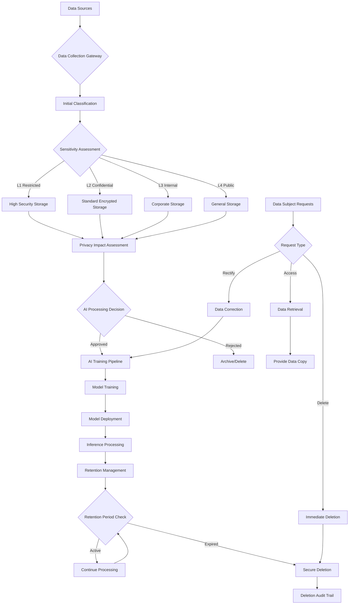

---

## 🗂️ Storage Architecture by Classification Level

### L1 - Restricted Data Flow 🔴

**Storage Requirements:**
- Air-gapped environment or dedicated secure cloud
- AES-256 encryption at rest
- TLS 1.3 for all data in transit
- Hardware Security Module (HSM) key management

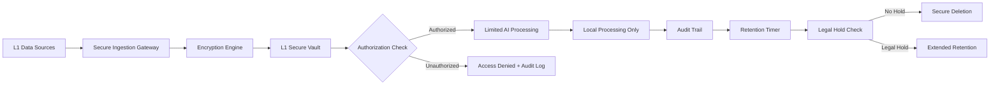

**Retention Schedule:**
- **Healthcare:** Per HIPAA/state requirements (typically 6+ years)
- **Financial:** 7 years (SOX compliance)
- **Legal Hold:** Indefinite until hold released
- **Patient/Client Request:** Immediate evaluation for deletion

### L2 - Confidential Data Flow 🟡

**Storage Requirements:**
- Approved cloud providers with encryption
- Geographic data residency compliance
- Role-based access controls
- Quarterly access certification

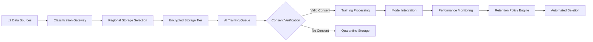

**Retention Schedule:**
- **Default:** 5 years maximum
- **Customer Communications:** 3 years
- **Vendor Contracts:** 7 years post-contract
- **Training Datasets:** Model lifetime + 1 year

### L3 - Internal Data Flow 🟢

**Storage Requirements:**
- Standard corporate cloud storage
- Regional backup compliance
- Employee access by default
- Semi-annual access review

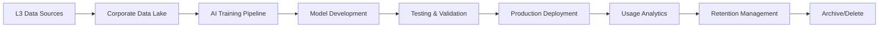

**Retention Schedule:**
- **Default:** 2 years unless actively used
- **System Logs:** 1 year
- **Training Records:** 3 years
- **Meeting Records:** 6 months

### L4 - Public Data Flow 🔵

**Storage Requirements:**
- Any approved storage platform
- Standard backup procedures
- Public access permitted
- Annual usage review

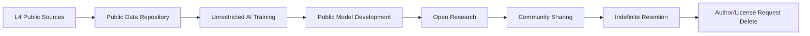

---

## 🔄 Cross-Border Data Transfer Flow

### International AI Training Pipeline

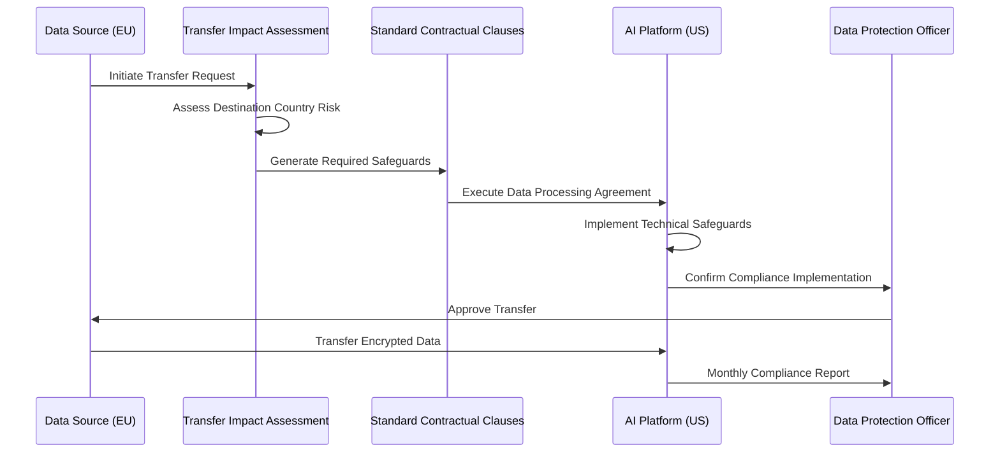

### Adequacy Decision Flow

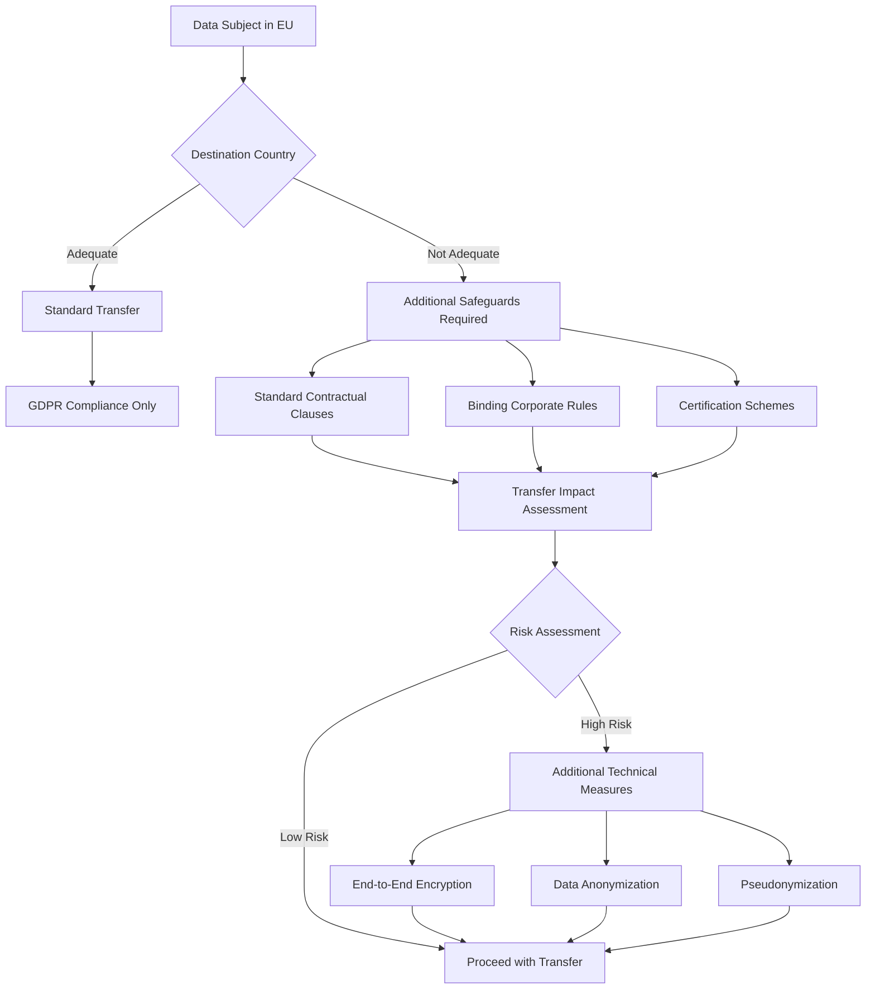

---

## ⏱️ Retention Timeline Visualization

### Healthcare Data Retention (HIPAA)

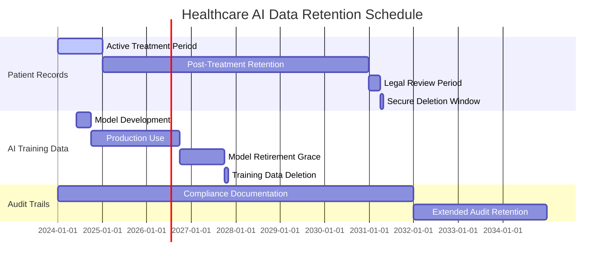

### Financial Services Retention (SOX)

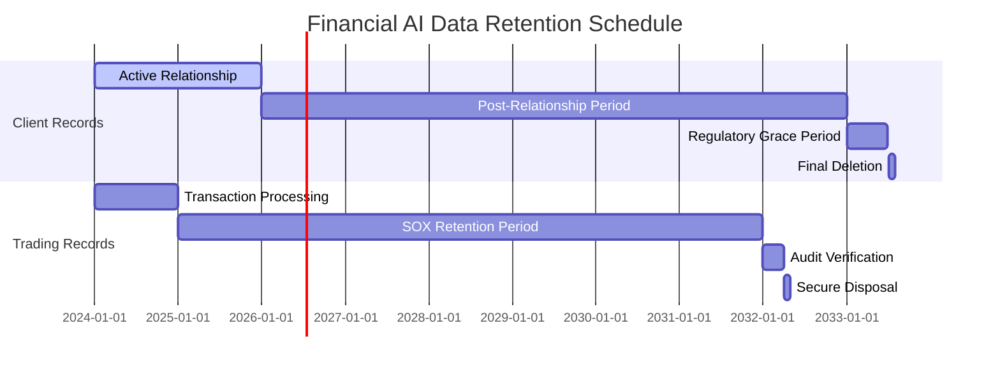

---

## 🔒 Secure Deletion Process Flow

### Automated Deletion Workflow

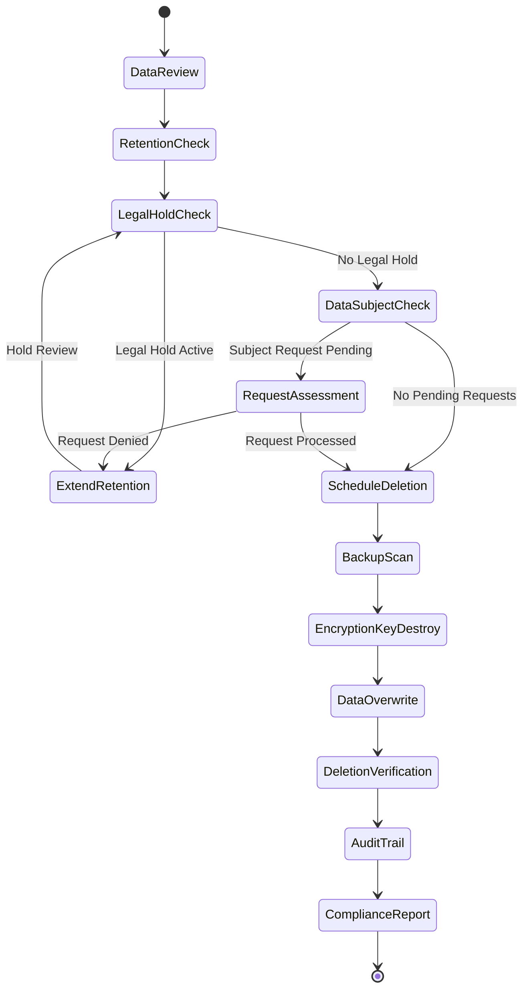

### Multi-System Deletion Coordination

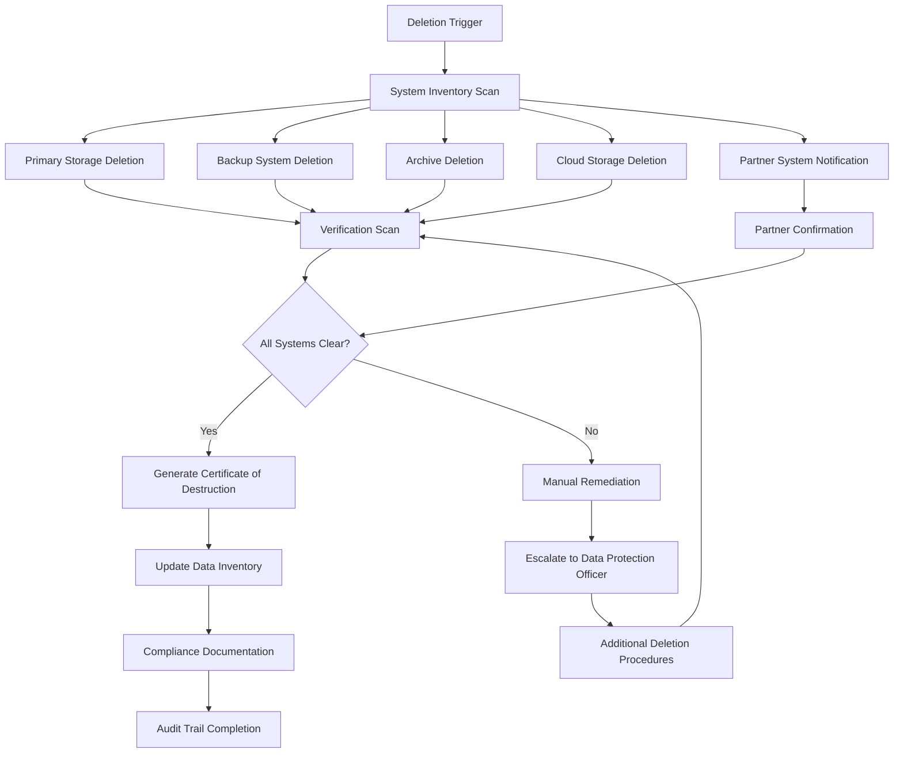

---

## 📱 Data Subject Rights Management Flow

### GDPR Rights Request Processing

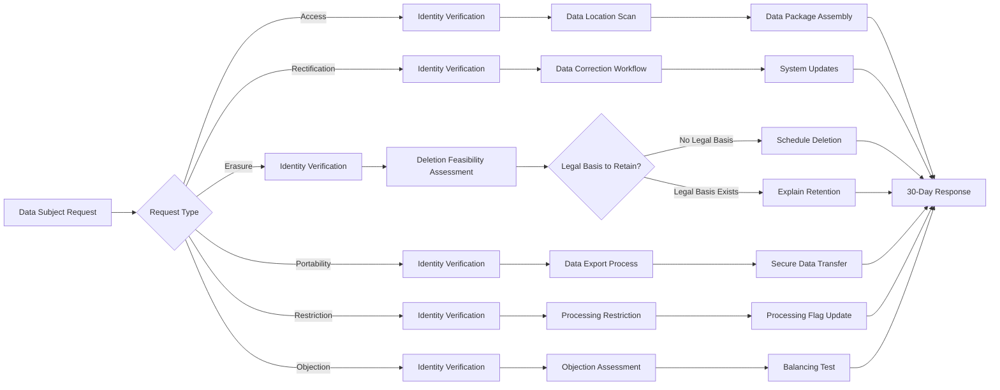

---

## 🔍 Monitoring and Audit Flow

### Real-Time Data Processing Monitoring

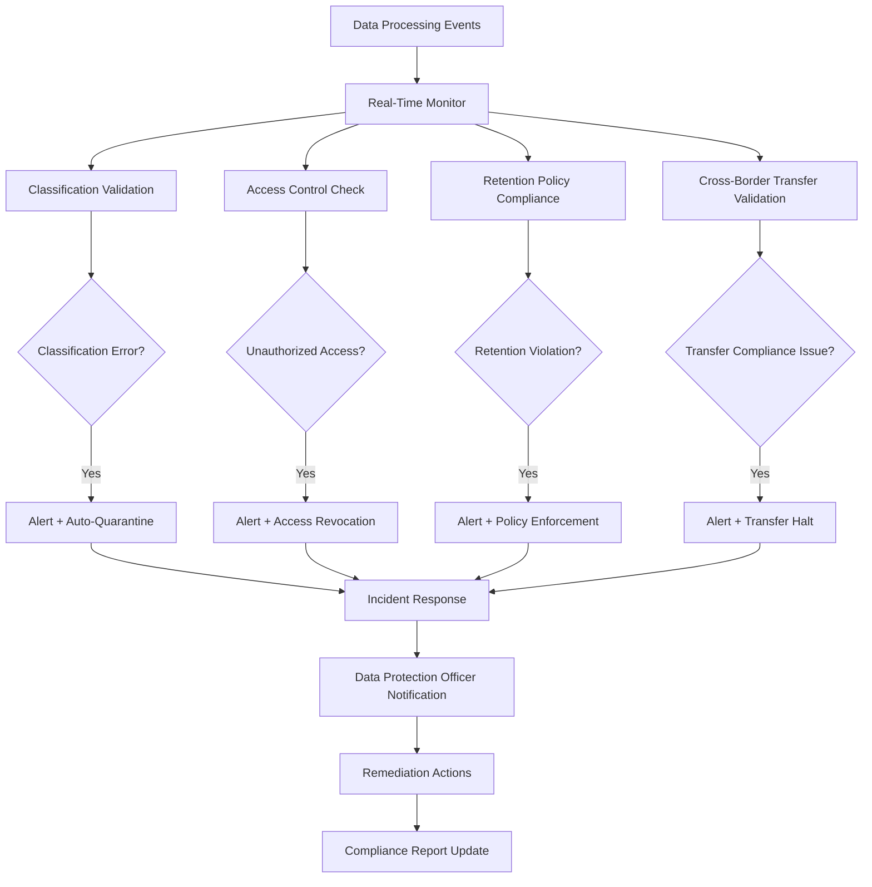

### Quarterly Compliance Audit

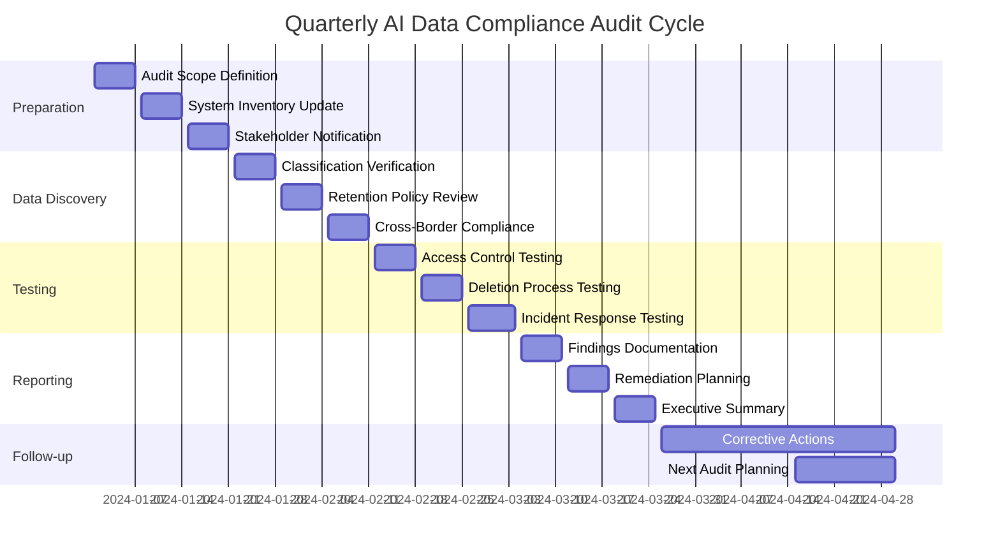

---

## 🌐 Integration Points with Other Kits

### Data Flow Between Defense Kit Modules

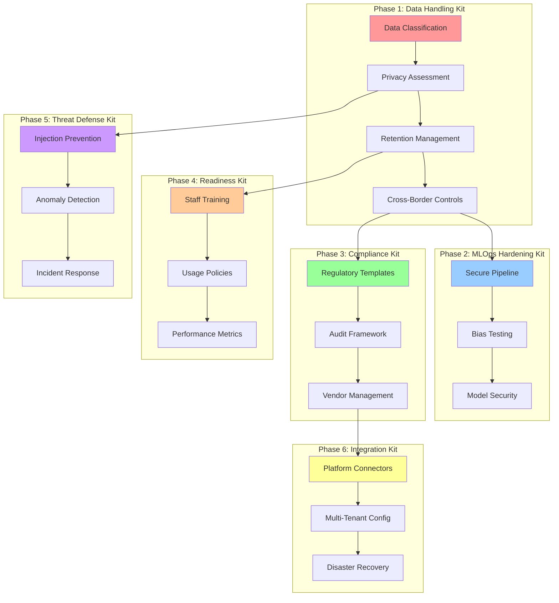

---

## 📋 Implementation Checklist

### Data Flow Implementation Verification

**Phase 1: Foundation Setup**
- [ ] Data sources identified and mapped
- [ ] Classification rules configured for sector
- [ ] Storage tiers properly segmented by sensitivity
- [ ] Encryption at rest and in transit verified

**Phase 2: Processing Pipeline**
- [ ] AI training pipeline integrated with classification
- [ ] Consent verification mechanisms operational
- [ ] Cross-border transfer controls implemented
- [ ] Retention timers configured and tested

**Phase 3: Monitoring & Compliance**
- [ ] Real-time monitoring dashboard deployed
- [ ] Audit trails comprehensive and tamper-proof
- [ ] Data subject rights request handling automated
- [ ] Compliance reporting automated

**Phase 4: Integration & Scaling**
- [ ] Cross-kit data flows validated
- [ ] Multi-tenant separation verified (if applicable)
- [ ] Disaster recovery procedures tested
- [ ] Performance benchmarks met

---

**🔗 Related Documentation:**
- [Data Classification Matrix](./data-classification-matrix.md)
- [Privacy Impact Assessment](./privacy-impact-template.md)
- [Retention & Deletion Policy](./retention-deletion-policy.md)
- [Cross-Border Controls](./cross-border-controls.md)

**📊 Live Monitoring:** Access your data flow dashboard at `/monitoring/data-flows`
