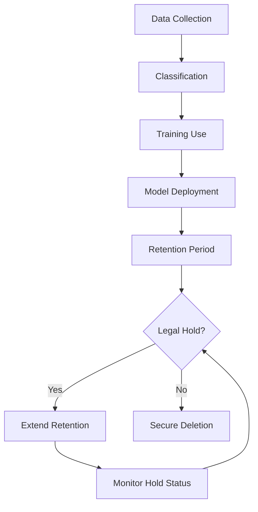

# 🗂️ AI Data Retention & Deletion Policy

## Policy Overview

**Purpose:** Establish clear guidelines for AI training data and model output retention, ensuring compliance with privacy regulations while maintaining operational effectiveness.

**Scope:** All AI systems, training datasets, model outputs, and derived analytics within the organization.

**Effective Date:** _________________  
**Review Period:** Annual  
**Policy Owner:** Chief Data Officer / Privacy Officer  

---

## Retention Schedule by Data Classification

### L1 - Restricted Data 🔴
**Retention Period:** As required by law, no longer than necessary  
**Default Maximum:** Per regulatory requirement (e.g., 7 years for financial, indefinite for some health records)

| Data Type | Retention Period | Legal Basis | Deletion Trigger |
|-----------|------------------|-------------|------------------|
| Patient health records | Per HIPAA/state law | Legal obligation | Patient request + retention period |
| Financial trading records | 7 years (SOX) | Legal obligation | Automatic after 7 years |
| Biometric data | Until purpose fulfilled | Consent | Consent withdrawal |
| Personal tax information | 7 years | Legal obligation | Automatic after 7 years |
| Criminal background checks | 3 years | Legal obligation | Automatic after 3 years |

### L2 - Confidential Data 🟡
**Retention Period:** 3-7 years maximum  
**Default:** 5 years unless specified otherwise

| Data Type | Retention Period | Business Justification | Deletion Trigger |
|-----------|------------------|------------------------|------------------|
| Customer communication logs | 3 years | Customer service | Automatic after 3 years |
| Employee performance data | 3 years post-employment | HR legal defense | Employment end + 3 years |
| Vendor contracts and communications | 7 years post-contract | Legal/audit requirements | Contract end + 7 years |
| Internal research data | 5 years | Innovation pipeline | Project completion + 5 years |
| AI training datasets (proprietary) | 5 years | Model improvement | Model retirement + 1 year |

### L3 - Internal Data 🟢
**Retention Period:** 1-3 years maximum  
**Default:** 2 years unless actively used

| Data Type | Retention Period | Business Justification | Deletion Trigger |
|-----------|------------------|------------------------|------------------|
| Internal communications | 1 year | Operational continuity | Automatic after 1 year |
| Meeting recordings/transcripts | 6 months | Reference/action tracking | Automatic after 6 months |
| System logs and monitoring data | 1 year | Security/troubleshooting | Automatic after 1 year |
| AI model performance metrics | 2 years | Model optimization | Model retirement |
| Employee training records | 3 years | Compliance verification | Employee departure + 1 year |

### L4 - Public Data 🔵
**Retention Period:** Indefinite (unless requested for deletion)  
**Default:** Retain until no longer useful

| Data Type | Retention Period | Business Justification | Deletion Trigger |
|-----------|------------------|------------------------|------------------|
| Published research papers | Indefinite | Knowledge preservation | Author request |
| Marketing materials | 5 years | Brand consistency | Campaign end + 5 years |
| Public dataset derivatives | Indefinite | Research reproducibility | Source dataset removal |
| Open source contributions | Indefinite | Community value | License change |

---

## AI-Specific Retention Rules

### Training Data Lifecycle



### Model Outputs and Derivatives
- **Generated Content:** Inherit classification of source training data
- **Model Weights:** Retain for model versioning (2 years post-retirement)
- **Inference Logs:** Retain per data classification (L2: 1 year, L3: 6 months)
- **Bias Testing Results:** Retain for audit purposes (5 years)
- **Performance Metrics:** Retain for optimization (2 years post-model retirement)

### Federated Learning Considerations
- **Local Model Updates:** Delete after aggregation (30 days maximum)
- **Aggregated Models:** Standard retention per classification
- **Participation Logs:** Retain for audit (1 year)
- **Node Contributions:** Anonymized metrics only (2 years)

---

## Deletion Procedures

### Automated Deletion Workflows

**Daily Automated Tasks:**
```bash
# Check for expired data
./tools/check-expired-data.sh --classification=all

# Process deletion queue
./tools/process-deletions.sh --verify-before-delete

# Generate deletion reports
./tools/deletion-report.sh --output=daily-deletion-$(date +%Y%m%d).pdf
```

**Weekly Automated Tasks:**
```bash
# Full retention audit
./tools/retention-audit.sh --full-scan

# Legal hold verification
./tools/legal-hold-check.sh

# Backup verification and pruning
./tools/backup-cleanup.sh --older-than=retention-period
```

### Manual Deletion Triggers

#### Data Subject Requests
**Timeline:** 30 days from verified request  
**Process:**
1. Verify identity and request validity
2. Locate all data instances (including backups)
3. Assess legal obligations to retain
4. Execute deletion if permissible
5. Provide confirmation to data subject

#### Right to be Forgotten (GDPR)
**Timeline:** 30 days from request  
**Scope:** All personal data unless legal exemption applies  
**Process:**
```bash
# Initiate GDPR deletion request
./tools/gdpr-deletion-request.sh --subject-id="[ID]" --verification="[proof]"

# Scan all systems for subject data
./tools/subject-data-scan.sh --subject-id="[ID]" --include-backups

# Execute deletion across all systems
./tools/execute-gdpr-deletion.sh --request-id="[ID]" --confirm-all
```

#### Business Decision Deletion
**Timeline:** Next scheduled maintenance window  
**Process:**
1. Business justification documented
2. Data classification review
3. Legal/compliance approval
4. Technical deletion execution
5. Audit trail documentation

### Secure Deletion Standards

#### Local Storage Deletion
- **Standard:** NIST SP 800-88 Guidelines
- **Method:** Cryptographic erasure for encrypted data, overwriting for unencrypted
- **Verification:** Post-deletion scanning to confirm removal
- **Documentation:** Certificate of destruction for L1/L2 data

#### Cloud Storage Deletion
- **Provider Verification:** Obtain deletion confirmation from cloud provider
- **Encryption Key Destruction:** For encrypted data, verify key destruction
- **Multi-Region Cleanup:** Ensure deletion across all geographic regions
- **Service Level Agreements:** Verify compliance with contractual deletion terms

#### Backup System Deletion
- **Identification:** Locate all backup copies across systems
- **Scheduling:** Coordinate deletion with backup rotation cycles
- **Verification:** Confirm removal from archive systems
- **Historical Backups:** Address legacy backups per retention schedule

---

## Exception Management

### Legal Holds
**Definition:** Suspension of normal deletion due to legal proceedings  
**Process:**
1. Legal counsel identifies affected data
2. Automated deletion disabled for specified datasets
3. Regular review of hold status
4. Lift hold when legal matter concludes

**Documentation:**
```yaml
Legal Hold Record:
  case_id: "CASE-2024-001"
  affected_data: 
    - "customer_communications_2023"
    - "transaction_logs_q1_2024"
  hold_date: "2024-01-15"
  review_date: "2024-04-15"
  status: "active"
  legal_contact: "legal@company.com"
```

### Regulatory Investigations
**Extended Retention:** Data may need extended retention during regulatory investigation  
**Notification:** Privacy officer notified within 24 hours  
**Documentation:** Investigation scope and data preservation requirements

### Business Continuity
**Operational Necessity:** Critical business data may warrant retention extension  
**Approval Process:** Business case review by data governance committee  
**Time Limits:** Maximum 12-month extension, renewable with justification

---

## Sector-Specific Considerations

### Healthcare/Clinical
- **HIPAA Minimum Necessary:** Retain only data necessary for treatment, payment, or operations
- **Research Data:** Different retention rules for de-identified research data
- **Medical Records:** Follow state-specific medical record retention requirements
- **Patient Rights:** Honor patient requests for data deletion where legally permissible

### Financial Services/Family Offices
- **SOX Compliance:** Financial records retention per regulatory requirements
- **Client Data:** Follow investment advisor record-keeping rules
- **Transaction Records:** Maintain audit trail for regulatory examination
- **Anti-Money Laundering:** Extended retention for suspicious activity records

### MSP/Multi-Client
- **Client-Specific Policies:** Honor individual client retention preferences
- **Service Level Agreements:** Comply with contractual data handling terms
- **Data Segregation:** Maintain separate retention schedules per client
- **Client Notification:** Inform clients of data deletion schedules

---

## Monitoring and Compliance

### Retention Metrics Dashboard
```yaml
Daily Metrics:
  - data_approaching_deletion: count
  - automated_deletions_completed: count
  - failed_deletion_attempts: count
  - legal_holds_active: count

Weekly Metrics:
  - retention_policy_compliance: percentage
  - storage_cost_by_classification: cost
  - data_subject_requests_processed: count
  - backup_cleanup_completion: percentage

Monthly Metrics:
  - retention_schedule_adherence: percentage
  - cross_classification_data_migration: count
  - policy_exception_requests: count
  - audit_readiness_score: percentage
```

### Audit Requirements
**Internal Audits:** Quarterly retention compliance review  
**External Audits:** Annual third-party assessment  
**Regulatory Audits:** On-demand for compliance verification  
**Documentation:** Maintain 3-year audit trail of all deletion activities

### Training and Awareness
**Staff Training:** Annual retention policy training for all data handlers  
**Role-Specific Training:** Specialized training for data classification roles  
**Update Notifications:** Immediate notification of policy changes  
**Compliance Testing:** Quarterly retention procedure testing

---

## Policy Enforcement

### Violations and Consequences
**Minor Violations:** (e.g., delayed deletion)
- Additional training required
- Increased monitoring period
- Process improvement plan

**Major Violations:** (e.g., unauthorized retention extension)
- Formal disciplinary action
- System access review
- Legal/compliance investigation

**Severe Violations:** (e.g., deliberate data retention violations)
- Termination consideration
- Regulatory reporting if required
- Criminal referral if applicable

### Reporting Structure
**Immediate Escalation:** Data retention violations > 30 days  
**Management Reporting:** Monthly summary to executive team  
**Board Reporting:** Annual retention compliance report  
**Regulatory Reporting:** As required by applicable laws

---

**Document Control:**
- **Version:** 1.0
- **Effective Date:** [Date]
- **Next Review:** [Date + 12 months]
- **Approved By:** [Chief Data Officer]
- **Distribution:** All staff with data access

*This policy is subject to applicable laws and regulations. When in conflict, legal requirements take precedence.*
